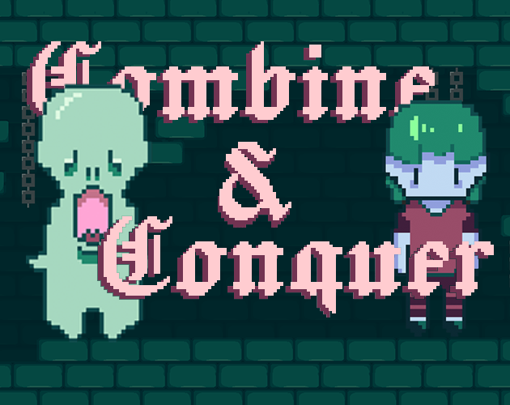
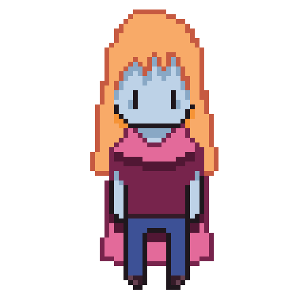
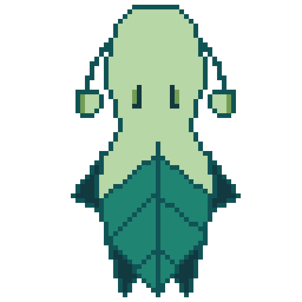
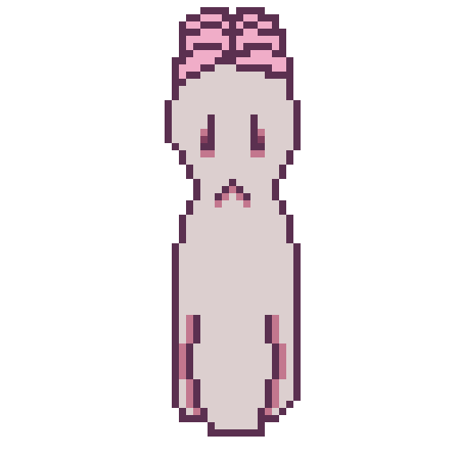
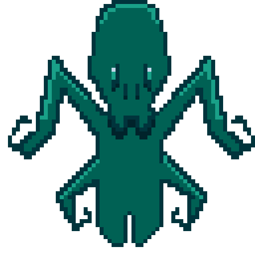

# Combine & Conquer

Game Jam: [Godot Wild Jam 68: Forge](https://itch.io/jam/godot-wild-jam-68)

    
    
    

Build your factory!  
Discover new items!  
Defend against hordes of enemies!  
Automate everything!  

    
    
    
    

## Controls - Mouse

Can be played with mouse only.

| Button      | Description          |
| ----------- | -------------------- |
| Left Click  |  Build / Drag Items  |
| Right Click | Destroy              |
| Escape      | Menu                 |
| Numbers 1-7 | Select Tool Shortcuts|
